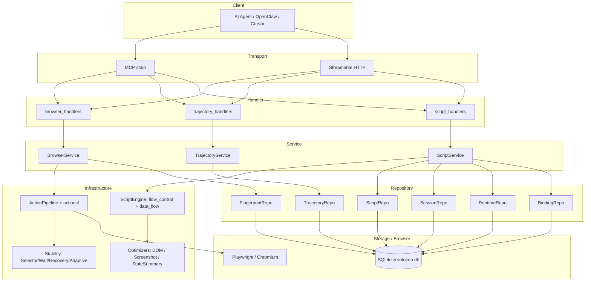

# ZeroToken

<!-- mcp-name: io.github.AMOS144/zerotoken -->

[](https://github.com/AMOS144/zerotoken/actions/workflows/ci.yml)
[](https://pypi.org/project/zerotoken/)
[](https://pypi.org/project/zerotoken/)
[](https://pepy.tech/project/zerotoken)
[](https://opensource.org/licenses/MIT)

**ZeroToken - Record once, automate forever.**

> Lightweight MCP for AI agent browser automation. Record once, replay forever — cut token cost and speed up repetitive tasks.

一个面向 AI Agent 的轻量化浏览器自动化 MCP 引擎，支持操作记录与详细执行上下文导出。

## 在 OpenClaw 中使用 ZeroToken

ZeroToken 是 OpenClaw 的浏览器执行层，适合**录制一次、重复执行**的自动化任务（如每日登录、定时抓取）。下面说明完整接入流程。

### 为什么需要 HTTP 模式？

OpenClaw 通过 MCPorter 调用 MCP 时，若使用 stdio（command 模式），**每次工具调用都会新建进程**，导致 browser 实例被销毁、状态丢失。因此必须改用 **Streamable HTTP 模式**：ZeroToken 以 HTTP 服务常驻，OpenClaw 通过 URL 连接，同一会话内 browser 状态得以保持。

### 接入步骤（完整流程）

#### 1. 安装 ZeroToken

```bash
# 通过 pip 或 uv
pip install zerotoken
# 或
uv add zerotoken

# 安装 Playwright 浏览器（必须）
playwright install chromium
```

若通过 MCPorter 安装到 OpenClaw：

```bash
npm install -g mcporter
mcporter install zerotoken --target openclaw --configure
```

安装后同样需执行 `playwright install chromium`。

#### 2. 在后台启动 HTTP 服务，并保持常驻

在终端中运行（**不要关闭**）：

```bash
zerotoken-mcp-http
```

默认监听 `http://0.0.0.0:8000/mcp`。可指定端口：

```bash
zerotoken-mcp-http --port 8001
# 或
ZEROTOKEN_HTTP_PORT=8001 zerotoken-mcp-http
```

#### 3. 配置 openclaw.json

在 `~/.openclaw/openclaw.json`（或项目内 `openclaw.json`）的 `mcpServers` 中，将 ZeroToken 配置为 **URL**，不要用 command：

```json
{
  "mcpServers": {
    "zerotoken": {
      "url": "http://localhost:8000/mcp"
    }
  }
}
```

若使用非默认端口，修改 URL 中的端口号即可。

#### 4. 安装 zerotoken-openclaw Skill

将 Skill 放入 OpenClaw 的 skills 目录之一：

或通过 ClawHub：`clawhub install zerotoken-openclaw`

或从本仓库复制：

```bash
cp -r skills/zerotoken-openclaw ~/.openclaw/skills/
```

#### 5. 在 OpenClaw 中启用

在 OpenClaw 中启用名为 `zerotoken` 的 MCP server，并确保 `zerotoken-openclaw` Skill 已加载。Agent 即可通过 MCP 调用浏览器工具。

### 典型工作流

1. **录制轨迹**：用户描述任务（如「每日登录某站并拉取报表」），Agent 调用 `browser_init` → `browser_open` / `browser_click` / `browser_input` 等 → `trajectory_complete`，完成一次录制。
2. **生成脚本**：对重复/定时任务，Agent 调用 `trajectory_to_script(task_id)` 将轨迹转为可回放脚本。
3. **绑定定时任务**：Agent 调用 `script_binding_set(binding_key=job_id, script_task_id=task_id)` 将 OpenClaw 的 job_id 与脚本绑定。
4. **定时执行**：OpenClaw 触发定时任务时，Agent 调用 `run_script_by_job_id(binding_key=job_id)` 一步执行，无需 LLM 逐步推理，Token 消耗低。

更多详情见：`skills/zerotoken-openclaw/SKILL.md`、`docs/skills.md`。

### 常见问题

- **browser 状态丢失、每次操作都像第一次**：说明仍在使用 command 模式。请确保 (1) 在后台运行 `zerotoken-mcp-http`；(2) `openclaw.json` 中 `zerotoken` 配置为 `url` 而非 `command`。
- **连接失败 / MCP 不可用**：确认 `zerotoken-mcp-http` 已启动且端口正确（默认 8000），URL 与配置一致。

## 核心理念

### 问题
AI Agent 直接控制浏览器执行重复任务时，每次都需要消耗大量 Token 进行推理，成本高且执行速度慢。

### ZeroToken 解决方案

1. **操作执行**: AI 通过 ReAct 模式分步推理，调用 MCP 原子能力完成浏览器操作
2. **轨迹记录**: 系统记录完整的操作轨迹（包括页面状态、截图、执行结果、模糊点标记）
3. **AI 提示导出**: 轨迹可导出为 AI 友好格式，含需判断的模糊点说明，供 Skills 或其他模块进一步分析

## 核心特性

- **分层架构** - Transport → Handler → Service → Domain → Repository/Infrastructure 五层，Pydantic v2 强类型模型
- **完整轨迹记录** - 每次操作记录步骤、页面状态、截图，结构化 OperationRecord
- **多标签页与 iframe** - 内置 BrowserContextManager，支持多 tab 切换、iframe 进入/退出、独立指纹与状态
- **丰富的浏览器原子操作** - 26 个 browser_* 工具：导航、点击/输入/hover/键盘/滚动/拖拽、文件上传下载、JS 求值、截图等
- **Script Engine** - 可嵌套步骤树 + VarsEnvironment，支持 if/loop/assign 流程控制、变量传递、白名单 AST 安全表达式、循环上限保护
- **Step-as-Unit 错误处理** - 任意步骤失败/需判断时暂停（pause），AI 通过 resolution 决定 retry/skip/patch/abort
- **录制探索模式** - `trajectory_explore_start/stop` 隔离 AI 试错路径，避免污染轨迹
- **Token 优化** - DOM 智能剪枝、截图压缩/裁剪/降质、页面状态摘要，多层次降低 Token 消耗
- **SQLite 存储** - scripts / trajectories / sessions / fingerprints / bindings / runtime 按职责拆分 Repo，版本化迁移
- **脚本生命周期管理** - script_deprecate/restore/health，自动跟踪连续失败、计算成功率
- **任务绑定** - script_bind 把外部 job_id 映射到脚本，便于 OpenClaw 等定时任务调度
- **稳定性增强** - SmartSelector（多备选 + 不稳定模式过滤）、SmartWait（多等待条件级联）、ErrorRecovery（指数退避 + 选择器变体 + iframe 内查找）
- **自适应元素定位** - 首次命中时保存元素指纹（auto_save），改版后选择器失效时按相似度重定位（adaptive），无需改代码
- **反爬/云盾应对** - `browser_init(stealth=true)` 启用隐蔽启动与指纹伪装，降低被识别为自动化浏览器的概率
- **MCP 协议** - stdio + Streamable HTTP 双 transport，handlers/ 模块化注册

## 稳定性增强

### 不稳定因素分析

```
选择器失效 (60%)     动态 ID、类名变化、DOM 结构改变
时序问题 (25%)       元素未加载、网络请求、动画未执行
环境变化 (10%)       视口变化、用户状态、Cookie 影响
其他因素 (5%)        弹窗干扰、资源加载失败
```

### 解决方案

**1. SmartSelector - 智能选择器生成**
- 自动生成多个备选选择器
- 优先级：data-testid > id > aria > CSS > XPath
- 检测并过滤不稳定类名（如 `el-*`, `ant-*`, `Mui-*`）

**2. SmartWait - 智能等待策略**
- 多种等待条件：selector, visible, networkidle, text, function
- 级联等待支持
- 页面稳定性检测

**3. ErrorRecovery - 错误恢复机制**
- 自动检测错误类型
- 选择器变体尝试
- 指数退避重试
- iframe 内元素查找

## 系统架构

五层分层，依赖方向**单向向下**：Handler → Service → Domain / Repository / Infrastructure，绝不反向。

```
┌─────────────────────────────────────────────────────────────────┐
│  Transport       MCP stdio  /  Streamable HTTP                   │
├─────────────────────────────────────────────────────────────────┤
│  Handler         handlers/{browser,trajectory,script}_handlers   │
│                  (工具注册 + 参数校验 + 调度)                     │
├─────────────────────────────────────────────────────────────────┤
│  Service         BrowserService  TrajectoryService  ScriptService│
│                  (业务编排, 无框架依赖)                           │
├─────────────────────────────────────────────────────────────────┤
│  Domain          Pydantic 模型 (OperationRecord, Trajectory,     │
│                  Script, Session, Resolution, ...)               │
├──────────────────────────────────┬──────────────────────────────┤
│  Repository                      │  Infrastructure              │
│  Protocol 抽象 + SQLite 实现     │  browser/  ActionPipeline    │
│  ScriptRepo / TrajectoryRepo /   │            + actions/        │
│  SessionRepo / RuntimeRepo /     │            + stability/      │
│  FingerprintRepo / BindingRepo   │  engine/   ScriptEngine      │
│                                  │            + flow_control    │
│                                  │            + data_flow       │
│                                  │  optimizers/ DOM/Screenshot/ │
│                                  │              StateSummary    │
└──────────────────────────────────┴──────────────────────────────┘
```

### Mermaid 架构图



## 安装

**OpenClaw 用户**：完整步骤见上文「[在 OpenClaw 中使用 ZeroToken](#在-openclaw-中使用-zerotoken)」。

**Cursor 等 IDE**：安装后使用 stdio 模式，在客户端配置 `command: "zerotoken-mcp"` 或 `command: "uv", args: ["run", "zerotoken-mcp"]` 即可。

### 本地开发 / pip 安装

```bash
# 克隆项目
git clone https://github.com/AMOS144/zerotoken.git
cd zerotoken

# 安装依赖
uv sync

# 或 pip 安装
pip install zerotoken

# 安装 Playwright 浏览器
playwright install chromium
```

## 快速开始

### 1. 启动 MCP Server

| 场景 | 命令 | 说明 |
|------|------|------|
| **OpenClaw** | `zerotoken-mcp-http` | 在后台常驻，`openclaw.json` 配置 `url: "http://localhost:8000/mcp"`。详见「[在 OpenClaw 中使用 ZeroToken](#在-openclaw-中使用-zerotoken)」。 |
| **Cursor 等 IDE** | `zerotoken-mcp` 或由客户端拉起 | stdio 模式，配置 `command: "zerotoken-mcp"`。 |

```bash
# OpenClaw：HTTP 模式（后台常驻）
zerotoken-mcp-http

# Cursor：stdio 模式
zerotoken-mcp
```

### 2. AI Agent 通过 MCP 调用浏览器工具

示例流程：

```
# 初始化浏览器（遇反爬/云盾可传 stealth=true）
→ browser_init(headless=true)
← {"success": true, "config": {...}}

# 开始轨迹记录
→ trajectory_start(task_id="login_task", goal="登录系统")
← {"success": true, "task_id": "login_task"}

# 执行浏览器操作（自动记录到轨迹）
→ browser_open(url="https://example.com/login")
← {
     "step": 1,
     "action": "open",
     "params": {"url": "https://example.com/login"},
     "result": {"success": true, "title": "Login"},
     "page_state": {"url": "...", "title": "..."},
     "screenshot": "base64..."
   }

→ browser_input(selector="#username", text="testuser")
→ browser_input(selector="#password", text="secret123")
→ browser_click(selector="#submit-btn")

# 完成轨迹并获取 AI 提示（含模糊点标记）
→ trajectory_complete(export_for_ai=true)
← {
     "success": true,
     "ai_prompt": "Task Goal: 登录系统\n\nOperation History:\n[Step 1] open(...)\n[Step 2] click(...) [需判断: 验证码需识别]"
   }
```

AI 收到 `ai_prompt` 后，可结合 Skills 或自定义逻辑，对标记为「需判断」的步骤进行处理。建议通过 `trajectory_list` 查看已保存轨迹，对不需要的调用 `trajectory_delete(task_id)` 避免记录过多；browser 类工具可传 `include_screenshot: false` 减少响应体积；失败时返回结构化错误（含 `code`、`retryable`）便于模型重试。对关键元素可传 `auto_save: true` 保存指纹，改版后传 `adaptive: true` 自动重定位。

### 3. 更多浏览器操作

**多标签页与 iframe**：

```
→ browser_new_tab(url="https://second.example.com")     # 返回 tab_id
→ browser_list_tabs()                                    # 列出所有 tab
→ browser_switch_tab(tab_id=1)
→ browser_enter_iframe(selector="iframe#payment")
→ browser_click(selector="#confirm")                    # 在 iframe 内
→ browser_exit_iframe()
→ browser_close_tab(tab_id=1)
```

**文件 / 键盘 / 高级交互**：

```
→ browser_upload(selector="input[type=file]", file_path="/tmp/a.pdf")
→ browser_download(selector="a.export")                  # 返回保存路径
→ browser_keyboard(key="Control+S")
→ browser_hover(selector=".menu")
→ browser_drag_drop(source="#item", target="#bin")
→ browser_scroll(direction="down", amount=800)
→ browser_evaluate(expression="document.title")
```

**录制探索模式（试错时不污染轨迹）**：

```
→ trajectory_explore_start(reason="尝试不同入口")
→ browser_click(...)        # 这些步骤不会进入正式轨迹
→ browser_click(...)
→ trajectory_explore_stop(keep="none")    # none / last / all
→ browser_click("#correct-entry")          # 之后回到正式录入
```

**脚本生成与回放**：

```
→ script_generate(task_id="login_demo")                  # 由轨迹生成脚本
→ script_run(task_id="login_demo", vars={"user": "..."}) # 确定性回放
                                                          # 失败/需判断会暂停 → session
→ script_resume(session_id="...", resolution={"type": "retry"})
                                                          # 或 skip / patch / abort
→ script_health(task_id="login_demo")                    # 连续失败/成功率
→ script_deprecate(task_id="login_demo", reason="改版失效")
→ script_restore(task_id="login_demo")
```

**绑定外部 job_id（OpenClaw 定时任务）**：

```
→ script_bind(binding_key="daily-report", script_task_id="report_v3",
              default_vars={"date": "today"})
→ script_run(... )    # 通过 binding_key 间接触发
```

## Python API

主要使用方式是 MCP 工具调用。也可以直接在 Python 中使用底层 service：

```python
from zerotoken import BrowserService, TrajectoryService, ScriptService
from zerotoken.repository.sqlite import open_sqlite_repos

# 打开按职责拆分的仓库集合（共享一个 SQLite 文件）
repos = open_sqlite_repos("zerotoken.db")

browser = BrowserService()
await browser.init(headless=True)

trajectory = TrajectoryService(trajectory_repo=repos.trajectory)
trajectory.start("task_001", goal="登录系统")
trajectory.bind(browser)

await browser.open("https://example.com/login")
await browser.click("#submit")

result = trajectory.complete(export_for_ai=True)
print(result["ai_prompt"])

await browser.close()
```

> 公开导出：`BrowserService` / `TrajectoryService` / `ScriptService`，以及全部 Pydantic 模型（`OperationRecord` / `Trajectory` / `Script` / `Resolution` 等）。具体函数签名见 `zerotoken/services/`。

## OperationRecord 结构

每个浏览器操作都返回详细的 OperationRecord：

```json
{
  "step": 1,
  "action": "click",
  "params": {
    "selector": "#submit-btn",
    "timeout": 30000
  },
  "result": {
    "success": true,
    "navigated": true,
    "new_url": "https://example.com/dashboard"
  },
  "page_state": {
    "url": "https://example.com/dashboard",
    "title": "Dashboard",
    "timestamp": "2024-01-01T12:00:00"
  },
  "screenshot": "base64_encoded_image_data",
  "fuzzy_point": {
    "requires_judgment": true,
    "reason": "验证码需识别",
    "hint": "AI 视觉"
  },
  "timestamp": "2024-01-01T12:00:00"
}
```

`fuzzy_point` 为可选字段，仅在需要 AI/人判断的步骤存在。导出 AI 提示时，会追加 `[需判断: {reason}]` 等标记。

## 项目结构

```
zerotoken/
├── zerotoken/                       # 库主体
│   ├── __init__.py                  # 公开导出 services 与 Pydantic 模型
│   ├── models/                      # Domain 层 - Pydantic v2 模型
│   │   ├── operation.py             #   OperationRecord, PageState, ActionType, ...
│   │   ├── trajectory.py            #   Trajectory, TrajectoryMetadata
│   │   ├── script.py                #   Script, ScriptStep, StepHint
│   │   └── session.py               #   PauseEvent, Resolution, RuntimeState
│   ├── services/                    # Service 层 - 业务编排
│   │   ├── browser_service.py
│   │   ├── trajectory_service.py    #   含 RecordingMode（探索模式）
│   │   └── script_service.py        #   含 deprecate/restore/health
│   ├── repository/                  # Repository 层 - 按职责拆分
│   │   ├── protocols.py             #   Protocol 抽象
│   │   ├── sqlite.py                #   SQLite 实现
│   │   └── migrations.py            #   版本化迁移
│   ├── browser/                     # Infrastructure - 浏览器
│   │   ├── context.py               #   BrowserContextManager（多标签）
│   │   ├── pipeline.py              #   ActionPipeline
│   │   ├── actions/                 #   navigate/interact/extract/page_mgmt/iframe/file_ops
│   │   ├── stability/               #   middleware/selector/wait/recovery/adaptive
│   │   └── stealth.py
│   ├── engine/                      # Infrastructure - 脚本引擎
│   │   ├── script_engine_v2.py      #   执行器
│   │   ├── flow_control.py          #   if/loop/assign
│   │   ├── data_flow.py             #   VarsEnvironment + 安全表达式
│   │   └── script_generator.py      #   轨迹转脚本
│   ├── optimizers/                  # Infrastructure - Token 优化
│   │   ├── dom_pruner.py
│   │   ├── screenshot_opt.py
│   │   └── state_summary.py
│   ├── benchmark/                   # 性能基准套件
├── handlers/                        # Handler 层 - MCP 工具注册
│   ├── browser_handlers.py          #   26 个 browser_* 工具
│   ├── trajectory_handlers.py       #   trajectory_* 工具
│   └── script_handlers.py           #   script_* / run / resume / session / binding
├── mcp_server.py                    # 入口：MCP stdio
├── mcp_server_http.py               # 入口：Streamable HTTP
├── benchmark_cli.py                 # 基准测试 CLI
├── tests/                           # unit + integration
└── zerotoken.db                     # SQLite 数据库（运行时生成）
```

## 使用场景

1. **AI Agent 浏览器自动化** - OpenClaw、LLM Agent 等
2. **RPA 流程自动化** - 重复性网页操作录制回放
3. **数据采集** - 定时抓取网页数据
4. **自动化测试** - 记录测试步骤并回放

**OpenClaw 配套 Skill**：见 [docs/skills.md](docs/skills.md)，用于定时/重复任务时按轨迹重放、降低 Token 消耗。

## 社区

加入 **ZT Agent Club** QQ 群，一起交流 ZeroToken 与 AI Agent 自动化：


- 群号：942359087
- 扫一扫二维码，加入群聊

## 参与贡献

欢迎提 Issue 和 PR，详见 [CONTRIBUTING.md](CONTRIBUTING.md)。

## License

MIT License，见 [LICENSE](LICENSE)。

---

**ZeroToken** - Record once, automate forever.
